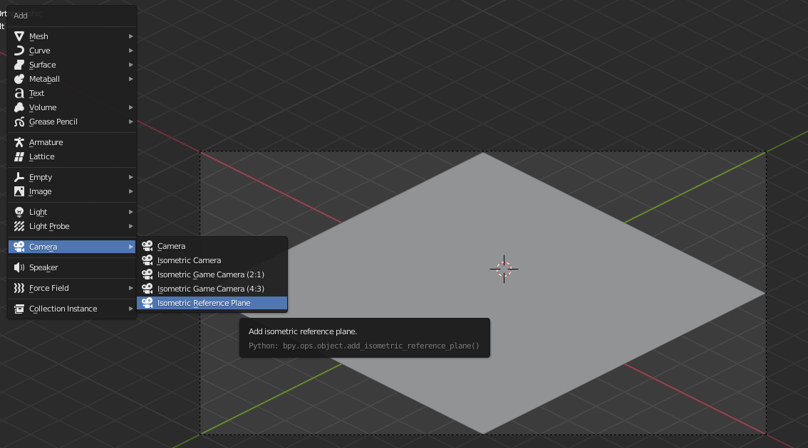

# Blender Addon: Isometric Camera

## Download

[isometric_cameras.py](https://github.com/sudo-bcli/isometric-cameras/releases/download/v1.0/isometric_cameras.py)

## Isometric Projection

Cameras with Isometric projection can be used to render sprites for 45 degree tile based games.

See:

* [Wikipedia](https://en.wikipedia.org/wiki/Isometric_projection)
* [Article](https://www.blender3darchitect.com/architectural-visualization/create-true-isometric-camera-architecture/)
* [Youtube Video](https://www.youtube.com/watch?v=YycYkyxwHr4)

## History

[Create IsoCam Addon](https://www.reinerstilesets.de/blender/createisocam.py) written by brilliant [Reiner 'Tiles' Prokein](https://www.reinerstilesets.de/)
for Blender 2.6 is not compatible with Blender 2.91, so I rewrite his code and made some minor improvements.

_And this is my first attempt to write a Blender addon (:3)_

## How to use

`Preferences->Addon->Install->isometric_cameras.py`, enable it,
 
 In 3D view, `Shift-A->Camera->Isometric Camera`

 

---
Benjamin Lee, 2020-12
