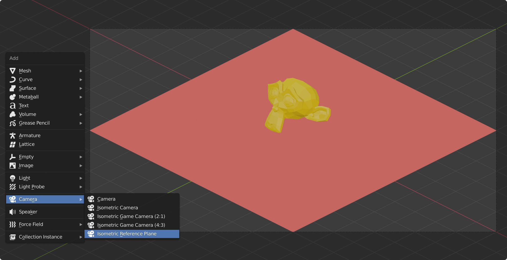

# Blender Addon: Isometric Cameras

[🇨🇳 简体中文](README_CN.md)

## 🎪 Showcase

## 📷 Isometric Projection

Isometric projection can be used in rendering sprites for 45 degree tile based games.

See:

* [🌐 Wikipedia](https://en.wikipedia.org/wiki/Isometric_projection)
* [📓 Article](https://www.blender3darchitect.com/architectural-visualization/create-true-isometric-camera-architecture/)
* [🧪 YouTube](https://www.youtube.com/watch?v=YycYkyxwHr4)

I found [Create IsoCam Addon](https://www.reinerstilesets.de/blender/createisocam.py) written by [Reiner 'Tiles' Prokein](https://www.reinerstilesets.de/)
is not compatible with Blender 2.91, so I rewrote his code and made minor improvements.

_And this is my first attempt to write a Blender addon 🥲_

## 💻 Install

1. Download [isometric_cameras.py](https://github.com/sudo-bcli/isometric-cameras/releases/)
2. In Blender `Edit->Preferences->Addon->Install`, open `isometric_cameras.py`, then `Enable Addon` (check box to to left).

## 🚀 Updates

* **2021-7-2** Test & update version to Blender 2.93.1

## 🐞 Bug Report

[Issue Tab](https://github.com/sudo-bcli/isometric-cameras/issues)

## 🗞️ License

[MIT](LICENSE)

-----
Benjamin Lee, 2020-12
