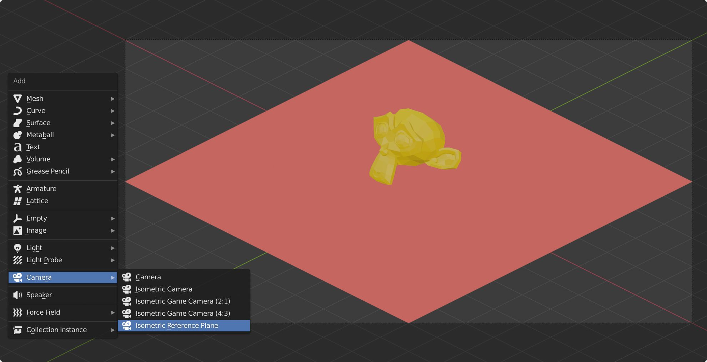

# Blender插件：等距相机

[🇺🇸 EN-US](README.md)

## 🎪 展示

## 📷 等距投影

等距投影可以用来为45度棋盘游戏（直译叫“瓷砖游戏”？Tile based）渲染精灵图(sprite)。

相关资料：

* [🐔 喂鸡百科](https://en.wikipedia.org/wiki/Isometric_projection)
* [📓 文章](https://www.blender3darchitect.com/architectural-visualization/create-true-isometric-camera-architecture/)
* [🧪 油管](https://www.youtube.com/watch?v=YycYkyxwHr4)

因为发现[Reiner 'Tiles' Prokein](https://www.reinerstilesets.de/)写的[Create IsoCam Addon](https://www.reinerstilesets.de/blender/createisocam.py)无法在Blender 2.91上运行，所自己重写了一下并作了一些小的改进。

_另外我是不会告诉你这是我写的第一个Blender插件 🥲_

## 💻 安装

1. 下载 [isometric_cameras.py](https://github.com/sudo-bcli/isometric-cameras/releases/)
2. Blender中 `编辑->偏好设置->插件->安装...`, 找到并选择 `isometric_cameras.py`, 然后点击 `启用插件` (插件左边的复选框)。

## 🚀 更新

* **2021-7-2** 经测试`Blender 2.93.1`可用，更改插件中的软件版本。

## 🐞 除虫

[Issue Tab](https://github.com/sudo-bcli/isometric-cameras/issues)

## 🗞️ 软件许可

[MIT](LICENSE)

-----
Benjamin Lee, 2020-12
